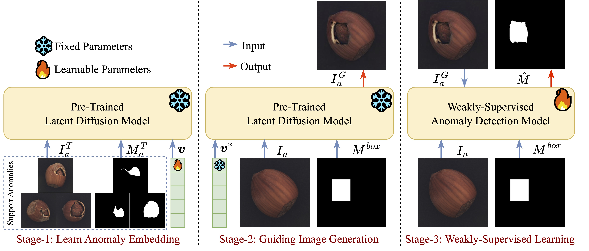

# [ECCV 2024] Few-Shot Anomaly-Driven Generation for Anomaly Detection


## Introduction

This repository is an official PyTorch implementation of [Few-Shot Anomaly-Driven Generation for Anomaly Classification and Segmentation](https://csgaobb.github.io/Pub_files/ECCV2024_AnoGen_CR_0730_Mobile.pdf) (ECCV 2024). 

<div align="center"></div>


This repository mainly consists of two parts. 
> The first part involves generating a large scale of realistic and diverse anomaly images based on the [LDM](https://github.com/CompVis/latent-diffusion) model, using few-shot real abnormal images. 

> The second part involves using the generated anomaly images to replace the synthetic anomalies in existing methods ([DRAEM](https://github.com/VitjanZ/DRAEM) and [DesTSeg](https://github.com/apple/ml-destseg)) to train an anomaly detection model, thereby validating the effectiveness of the generated anomalies for downstream tasks. 


<div align="center"></div>


## Preparation

Download MVTec anomaly detection dataset
```
mkdir ./datasets/mvtec
cd ./datasets/mvtec
wget https://www.mydrive.ch/shares/38536/3830184030e49fe74747669442f0f282/download/420938113-1629952094/mvtec_anomaly_detection.tar.xz
tar -xf mvtec_anomaly_detection.tar.xz
rm mvtec_anomaly_detection.tar.xz
```

Download pre-trained diffusion model

```
cd DIFFUSION
mkdir -p models/ldm/text2img-large/
wget -O models/ldm/text2img-large/model.ckpt https://ommer-lab.com/files/latent-diffusion/nitro/txt2img-f8-large/model.ckpt
```

Download Generated Anomaly Images [optional]()

| datasets |  Download Link |
|:---:|:---:|
|MVTec |[mega drive](https://mega.nz/file/dPIDBQIS#QZgplPS1USvl3YERzuRzm2UAuV7HZcMv50aTX2Qorpw)|
  

## Stage1: Learn Embedding with Few-Shot Anomaly Images

```
cd DIFFUSION
categories=("broken_large" "broken_small" "contamination")
words=("broken" "broken" "broken")
for ((i=0;i<3;i++))
do
    name="v2_bottle_${categories[$i]}" 
    path="mvtec_train_data/bottle/${categories[$i]}"
    word=${words[$i]}
    python main.py \
    --base configs/latent-diffusion/txt2img-1p4B-finetune.yaml \
    -t --actual_resume models/ldm/text2img-large/model.ckpt \
    -n $name \
    --gpus 0, \
    --data_root $path \
    --init_word "defect"
done
```

Given support images for all categories, you can train the embedding for each defect.

```
cd DIFFUSION
sh train.sh
```

## Stage2: Few-Shot Anomaly-Driven Generation 

Given a normal image and the expected defect bounding box, you can generate an anomaly image using the learned embedding and the pre-trained diffusion model.
```
cd DIFFUSION

python scripts/txt2img.py \
            --ddim_eta 0.0 \
            --n_samples 1 \
            --n_iter 2 \
            --scale 10.0 \
            --ddim_steps 50 \
            --embedding_path "logs/bottle_broken_large/embeddings.pt" \
            --ckpt_path "models/ldm/text2img-large/model.ckpt" \
            --prompt "*" \
            --mask_prompt "images/demo_images/mask.png" \
            --image_prompt "images/demo_images/bottle.png" \
            --outdir "outputs"
```

## Stage3: Weakly-Supervised Anomaly Detection

You can download the generated anomaly images for your model training.

Train DREAM model with generated images
```
cd DREAM
sh ./train.sh
sh ./test.sh
```

Train DREAM model with generated images
```
cd DeSTSeg
sh train.sh
sh test.sh
```


## Citing
If you find this code useful in your research, please consider citing us:
```
@inproceedings{2024anogen,
  title={Few-Shot Anomaly-Driven Generation for Anomaly Classification and Segmentation},
  author={Gui, Guan and Gao, Bin-Bin and Liu, Jun and Wang, Chengjie and Wu, Yunsheng},
  booktitle={European Conference on Computer Vision (ECCV 2024)},
  pages={--},
  year={2024}
}
``` 